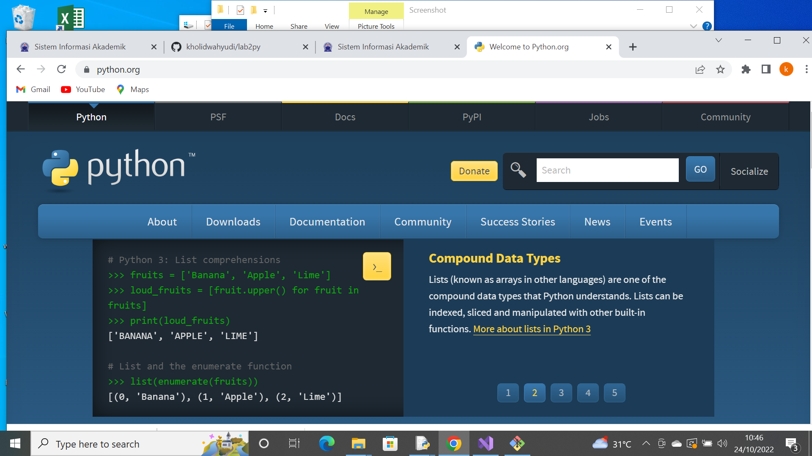
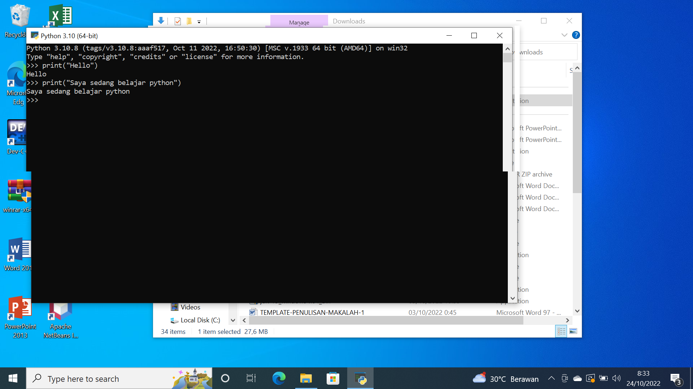
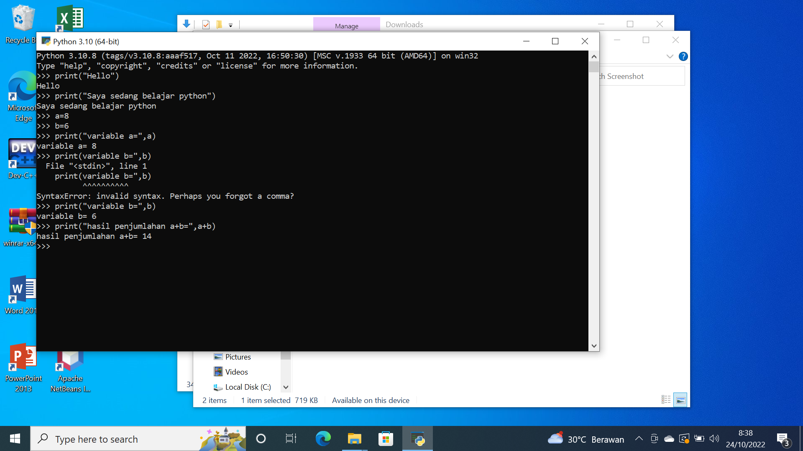
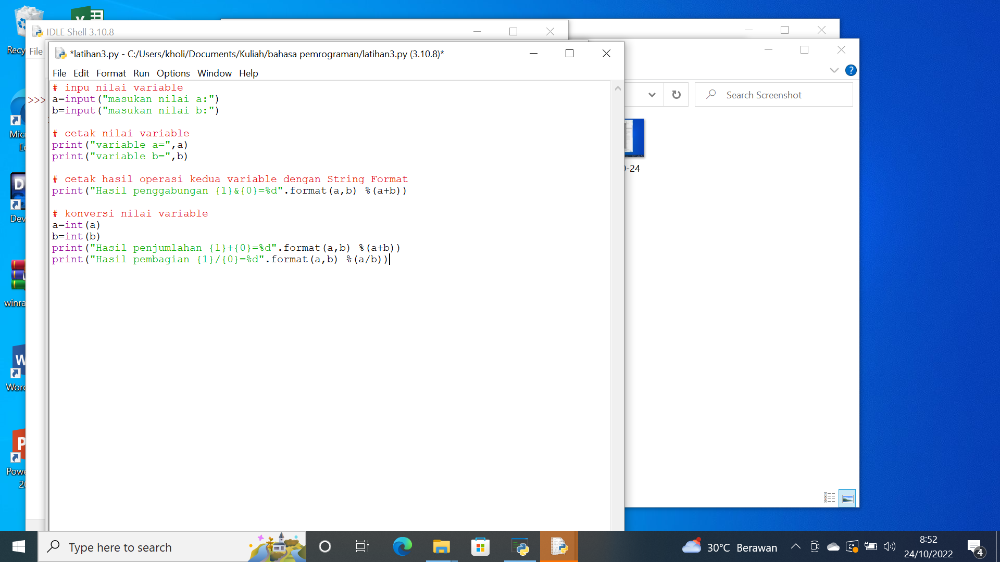
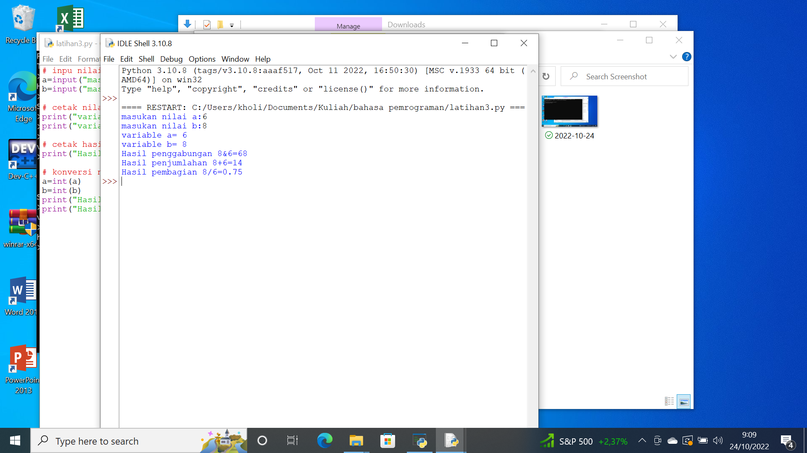

# lab2py

##langkah-langkah belajar phyton

1. sebelumnya kita download python terlebih dahulu di python.org

2. jalankan python console 
	> tampilkan hello dilayar
	> dan kalimat "saya sedang belajar python"

3. menjumlahkan dua bilangan menggunakan 2 variable a dan b

4. menggunakan fungsi input pada IDLE

5. kemudian kita running
